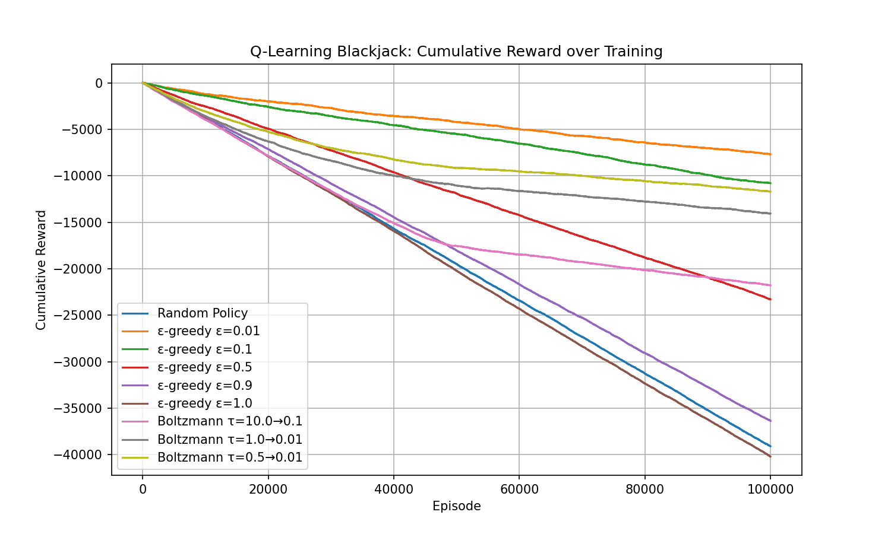
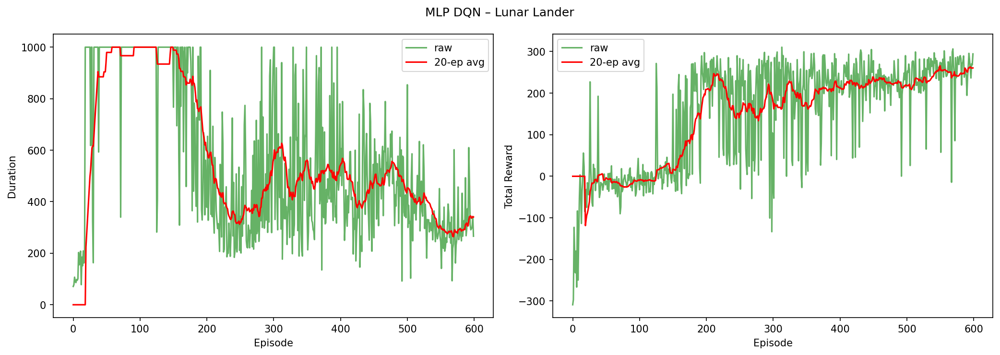

# Homework 4: Q-learning

Author: Hao Ren

Date: Feb 11, 2026

## Part 1: Tabular Q-Learning

### Experimental Setup

We implement one-step tabular Q-learning on the Blackjack-v1 environment. As a tabular Q-learning algorithm, the Q-table is just a dictionary mapping (state, action) pairs to estimated values.

**Hyperparameters (shared across configs):**
- Learning rate $\alpha$ = 0.01
- Discount factor $\gamma$ = 0.95
- Training episodes: 100,000
- Evaluation window (rolling average): 500 episodes

**Exploration strategies tested:**

We compare two families of exploration strategies:

1. **$\varepsilon$-greedy** with various fixed and decaying epsilon values:
   - Fixed: $\varepsilon$ = 0.01, 0.1, 0.5, 0.9, 1.0
   - Decaying: $\varepsilon = 0.1 \to 0.01$, $\varepsilon = 0.5 \to 0.05$, $\varepsilon = 1.0 \to 0.1$

2. **Boltzmann (softmax) exploration** with decaying temperature:
   - $\tau = 10.0 \to 0.1$
   - $\tau = 1.0 \to 0.01$
   - $\tau = 0.5 \to 0.01$

Epsilon and temperature are linearly decayed over the first half of training. A **random baseline** (uniform random action selection) is also evaluated for comparison.

### Results

The overall cumulative reward comparison across all configurations and the random baseline is shown below:

<!-- **$\varepsilon$-greedy with fixed epsilon:** -->

| Config | Detail Plot |
|--------|------------|
| $\varepsilon$ = 0.01 |  |
| $\varepsilon$ = 0.1 |  |
| $\varepsilon$ = 0.5 |  |
| $\varepsilon$ = 0.9 |  |
| $\varepsilon$ = 1.0 |  |

**$\varepsilon$-greedy with decaying epsilon:**

| Config | Detail Plot |
|--------|------------|
| $\varepsilon = 0.1 \to 0.01$ |  |
| $\varepsilon = 0.5 \to 0.05$ |  |
| $\varepsilon = 1.0 \to 0.1$ |  |

**Boltzmann exploration:**

| Config | Detail Plot |
|--------|------------|
| $\tau = 10.0 \to 0.1$ |  |
| $\tau = 1.0 \to 0.01$ |  |
| $\tau = 0.5 \to 0.01$ |  |

Each detail plot shows three panels: the rolling-average episode reward, episode length, and TD training error over the course of training.

### Discussion

1. **The cumulative reward only decreases.** Blackjack has a built-in house edge, so this means even an optimal policy has a negative expected reward per hand. Therefore, the cumulative reward inevitably goes downward. However, a well-trained agent loses *less steeply* than the random baseline, which confirms that learning is valid.

2. **Low $\varepsilon$ values converge faster but risk suboptimal policies.** With $\varepsilon$ = 0.01, the agent exploits almost immediately, so if early Q-estimates are poor, it may lock into a bad policy. Higher initial $\varepsilon$ (e.g., $1.0 \to 0.1$) explores more thoroughly before settling, leading to a better final policy despite a slower start.

3. **Decaying $\varepsilon$ outperforms fixed $\varepsilon$.** Fixed high $\varepsilon$ (0.5, 0.9, 1.0) wastes training steps on random actions even after the Q-table has converged, while fixed low $\varepsilon$ (0.01) under-explores. Decaying $\varepsilon$ allows the agent to explore sufficiently early on and then exploit later, resulting in better performance. In our experiments, $\varepsilon = 0.1 \to 0.01$ performed best. $\varepsilon = 0.5 \to 0.05$ also performed well but has more noise.

4. **Boltzmann exploration also performs well.** In all Boltzmann configs, the agent learns well, as the episodic reward curves show steady improvement.

## Part 2: DQN for lunar lander

### Experimental Setup

We implement a DQN agent using a 3-layer MLP architecture.

**Network architecture:** A 3-layer MLP ($8 \to 128 \to 128 \to 4$) with ReLU activations.

**Hyperparameters:**

We refer to the PyTorch DQN tutorial for recommended hyperparameters:

- Batch size: 128
- Discount factor $\gamma$ = 0.99
- Epsilon: $0.9 \to 0.01$ (exponential decay, $\tau$ = 2500 steps)
- Learning rate: $3 \times 10^{-4}$ (AdamW with AMSGrad)
- Target network: soft update with $\tau$ = 0.005 every step
- Replay memory: 100,000 transitions
- Loss: Smooth L1 (Huber) loss
- Gradient clipping: max value 100
- Training episodes: 600

**Baseline:** A random agent taking uniformly random actions over 100 episodes, providing average duration and reward reference lines on the training charts.

### Results

**MLP DQN training curves:**

The chart "Episode Duration Over Training" shows that the agent is able to land the lunar module faster over time, and the "Total Reward Per Episode" chart shows a increase in reward, until reaching a plateau around reward = 250, which is good enough for this experiment. I played this a few times and never get a positive reward :(. The best score I got is around -16. 

### Discussion

1. **Reward plateau around 250.** The agent learns to land successfully, but the reward does not improve much beyond 250. This either suggests the agent has reached the best possible reward given the current environment, or that it reaches a suboptimal policy that is good enough to land but not perfect. However, since the task is difficult, achieving a high reward around 250 is already a very promising result.

2. **Shortened episode duration.** For me, the shortened duration is unexpected, as I thought the agent would take more time to learn to land. But on second thought, it makes sense that the agent learns to land more quickly as it is hard to control the lander in a long episode, and also the reward structure encourages landing sooner.

## Extra Credit 2: DQN with CNN for car racing

Car racing is a much more complex environment, and training a DQN agent with convolutional layers to learn from pixels is significantly more challenging.

We created a DQN agent with convolutional layers to process the pixel input from the environment.

### Experimental Setup

**Preprocessing:** Each frame is converted to grayscale, cropped to remove the bottom status bar, and resized to $84 \times 84$. Four consecutive frames are stacked to form a $(4, 84, 84)$ input tensor, giving the network temporal information about motion and velocity.

**Network architecture:** CNN-based DQN: A convolutional neural network with three convolutional layers followed by two fully connected layers:
- Conv layers: Conv2d($4 \to 32$, $8 \times 8$, stride 4) $\to$ ReLU $\to$ Conv2d($32 \to 64$, $4 \times 4$, stride 2) $\to$ ReLU $\to$ Conv2d($64 \to 64$, $3 \times 3$, stride 1) $\to$ ReLU
- FC layers: Linear($3136 \to 512$) $\to$ ReLU $\to$ Linear($512 \to 5$)

**Hyperparameters:**
- Batch size: 128
- Discount factor $\gamma$ = 0.99
- Epsilon: $1.0 \to 0.05$ (exponential decay over 50,000 steps)
- Learning rate: $1 \times 10^{-4}$ (AdamW with AMSGrad)
- Target network: soft update with $\tau$ = 0.005 every 4 steps
- Replay memory: 50,000 transitions
- Loss: Smooth L1 (Huber) loss
- Gradient clipping: max value 100
- Optimization frequency: every 4 environment steps
- Training episodes: 500 (GPU) / 30 (CPU)
- cuDNN benchmark mode enabled for CNN acceleration

### Results

My machine was unable to train this agent due to memory constraints.
